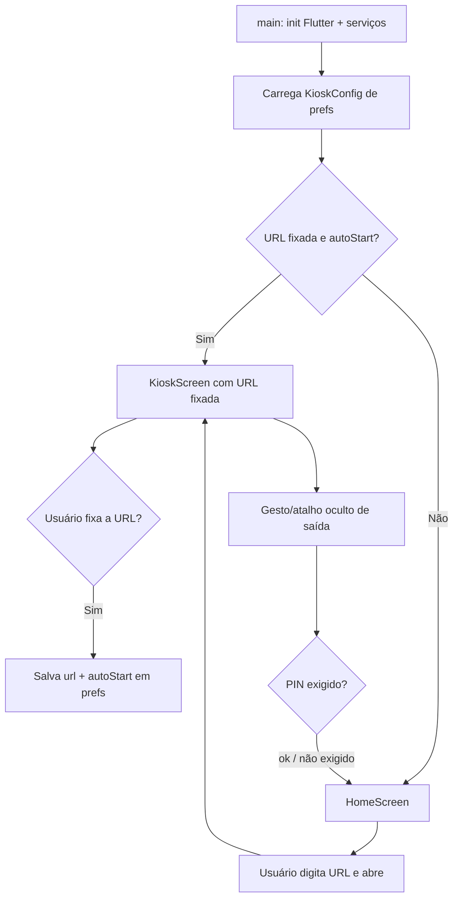

# SDD-002 — Arquitetura Geral

## 1. Visão em camadas

O app segue uma arquitetura em camadas leve (inspirada em Clean Architecture),
suficiente para o escopo sem sobre-engenharia.

```
┌─────────────────────────────────────────────────────────────┐
│ Presentation (UI)                                            │
│  • HomeScreen (entrada de URL, recentes, fixar)              │
│  • KioskScreen (WebView em tela cheia)                       │
│  • SettingsScreen / PinDialog                                │
│  • Widgets de erro/loading                                   │
└───────────────▲─────────────────────────────────────────────┘
                │ (Riverpod providers / controllers)
┌───────────────┴─────────────────────────────────────────────┐
│ Application / State                                          │
│  • KioskController  (estado da sessão de kiosque)            │
│  • SettingsController (URL fixada, PIN, prefs)               │
└───────────────▲─────────────────────────────────────────────┘
                │
┌───────────────┴─────────────────────────────────────────────┐
│ Services (capacidades nativas)                               │
│  • WebViewBridgeService (handlers JS ⇄ Flutter)              │
│  • TtsService (flutter_tts)                                  │
│  • KioskModeService (fullscreen, wakelock, janela)          │
│  • StorageService (cookies/cache/limpeza)                    │
└───────────────▲─────────────────────────────────────────────┘
                │
┌───────────────┴─────────────────────────────────────────────┐
│ Data                                                         │
│  • KioskSettingsRepository                                   │
│  • PrefsSource (shared_preferences)                          │
│  • Models: KioskConfig, RecentUrl                            │
└──────────────────────────────────────────────────────────────┘
```

## 2. Estrutura de pastas (lib/)

```
lib/
  main.dart                      # bootstrap + ProviderScope + init serviços
  app.dart                       # MaterialApp + router

  core/
    constants.dart               # chaves de prefs, defaults, nomes de canais JS
    theme.dart
    result.dart                  # tipo Result/Either simples para erros

  data/
    models/
      kiosk_config.dart          # url fixada, autoStart, pin, flags
      recent_url.dart
    sources/
      prefs_source.dart          # wrapper de shared_preferences
    repositories/
      kiosk_settings_repository.dart

  application/
    providers.dart               # providers Riverpod (DI)
    kiosk_controller.dart
    settings_controller.dart

  services/
    tts/
      tts_service.dart           # abstração sobre flutter_tts
    webview/
      webview_bridge_service.dart  # registra/roteia handlers JS
      js_messages.dart           # tipos das mensagens da ponte
    kiosk/
      kiosk_mode_service.dart    # fullscreen/imersivo, wakelock, window_manager
      kiosk_mode_service_android.dart
      kiosk_mode_service_windows.dart
    storage/
      storage_service.dart       # cookies/cache, limpar dados

  features/
    home/
      home_screen.dart
      widgets/url_field.dart
      widgets/recent_list.dart
    kiosk/
      kiosk_screen.dart          # InAppWebView + overlays
      widgets/error_overlay.dart
      widgets/exit_gesture.dart
    settings/
      settings_screen.dart
      pin_dialog.dart

assets/
  js/
    speech_polyfill.js           # polyfill do speechSynthesis (ver SDD-003)
    bootstrap.js                 # ajustes de autoplay/foco injetados no início
```

## 3. Dependências

> Versões de referência; confirmar a mais recente compatível no pub.dev na
> implementação. A coluna "Plataformas" indica suporte relevante ao projeto.

| Pacote | Versão ref. | Uso | Plataformas |
|--------|-------------|-----|-------------|
| `flutter_inappwebview` | ^6.1.5 | WebView com injeção de JS, handlers, settings de mídia/armazenamento | Android, Windows (WebView2) |
| `flutter_tts` | ^4.2.0 | TTS nativo (ponte de narração) | Android, Windows |
| `shared_preferences` | ^2.3.2 | Persistir URL fixada e config | Android, Windows |
| `flutter_riverpod` | ^2.6.1 | Estado e injeção de dependências | todas |
| `go_router` | ^14.6.0 | Rotas (splash → home/kiosk → settings) | todas |
| `window_manager` | ^0.4.3 | Tela cheia/sem moldura no Windows | Windows |
| `wakelock_plus` | ^1.2.8 | Manter tela ligada | Android, Windows |
| `connectivity_plus` | ^6.1.0 | Detectar rede para retry | Android, Windows |
| `crypto` | ^3.0.5 | Hash do PIN de saída | todas |

> **Atenção ao suporte Windows do `flutter_inappwebview`:** o suporte a Windows
> (via WebView2) foi introduzido na linha 6.x e é mais novo que o de Android.
> Caso surja limitação no Windows durante a implementação, o **plano B** é usar
> [`webview_windows`](https://pub.dev/packages/webview_windows) (WebView2) apenas
> no desktop, isolado atrás da interface `AppWebView` (ver §5). No Windows, o
> WebView2/Chromium **já implementa** a Web Speech API nativamente, então a ponte
> TTS é obrigatória apenas no Android — mas mantemos a ponte ligada em ambos para
> ter vozes e comportamento consistentes (configurável).

## 4. Fluxo de inicialização



## 5. Abstração do WebView (`AppWebView`)

Para não acoplar o código ao pacote escolhido e permitir o plano B no Windows,
todo acesso ao WebView passa por uma interface:

```dart
abstract class AppWebView {
  Future<void> loadUrl(String url);
  Future<void> reload();
  Future<Object?> evaluateJavascript(String source);
  void addJavaScriptHandler(String name, JsHandler handler);
  Stream<WebLoadState> get loadState;       // started/finished/error
  set settings(AppWebViewSettings s);       // autoplay, storage, etc.
}
```

Implementações: `InAppWebViewAdapter` (padrão, Android+Windows) e, se preciso,
`WebviewWindowsAdapter`. A `KioskScreen` depende apenas de `AppWebView` e do
`WebViewBridgeService`.

## 6. Modelos de dados

```dart
class KioskConfig {
  final String? pinnedUrl;     // null = sem URL fixada
  final bool autoStart;        // abrir direto na pinnedUrl
  final bool ttsBridgeEnabled; // forçar ponte de narração mesmo se nativa existir
  final bool autoplayAudio;    // permitir autoplay
  final String? exitPinHash;   // hash do PIN de saída (null = sem PIN)
  final List<RecentUrl> recents;
}

class RecentUrl {
  final String url;
  final DateTime lastOpened;
}
```

Persistidos como JSON em `shared_preferences` sob a chave `kiosk_config_v1`.

## 7. Tratamento de erros e resiliência

- `KioskController` escuta `loadState` e `connectivity_plus`.
- Em erro de carregamento: exibe `ErrorOverlay` com contagem regressiva e
  **retry automático** (backoff: 2s, 5s, 10s, depois 15s fixo).
- Em retorno de conectividade: recarrega automaticamente a URL atual.
- Logs locais simples (debugPrint em dev; sem PII em release).

## 8. Princípios de design

1. **Capacidades nativas isoladas em `services/`** — UI nunca chama plugins direto.
2. **A ponte TTS é o coração do produto** — tem seu próprio documento (SDD-003).
3. **Diferenças de plataforma escondidas atrás de serviços** (`*_android.dart`,
   `*_windows.dart`) selecionados em runtime via `Platform`/`defaultTargetPlatform`.
4. **Config-driven:** comportamentos (autoplay, ponte TTS, PIN) ligados/desligados
   por `KioskConfig`, facilitando testes.
