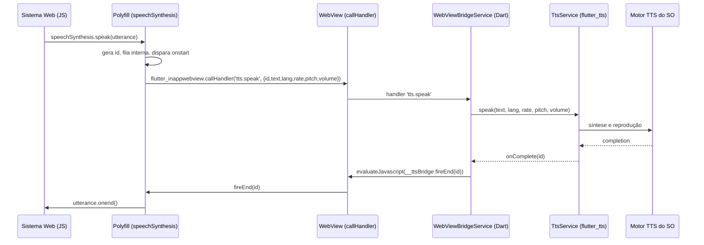

# SDD-003 — WebView, Persistência, Autoplay e Ponte de TTS

Este é o documento **central** do projeto. Ele cobre a configuração do WebView e
resolve os três requisitos críticos: **persistência de autenticação (RF-05)**,
**autoplay de áudio (RF-06)** e, principalmente, a **narração via Web Speech API
em WebViews que não a suportam (RF-07)**.

---

## 1. Configuração do WebView (`flutter_inappwebview`)

`InAppWebViewSettings` aplicados na criação do WebView:

```dart
final settings = InAppWebViewSettings(
  // --- Autoplay (RF-06) ---
  mediaPlaybackRequiresUserGesture: false,

  // --- Persistência / localStorage (RF-05) ---
  // DOM storage (localStorage/sessionStorage)
  // Android:
  domStorageEnabled: true,
  databaseEnabled: true,
  cacheEnabled: true,
  cacheMode: CacheMode.LOAD_DEFAULT,
  // Mantém o app "parecendo" um navegador real (alguns sistemas checam UA):
  // userAgent: '<custom se necessário>',

  // --- Comportamento geral ---
  javaScriptEnabled: true,
  javaScriptCanOpenWindowsAutomatically: false, // kiosque: sem popups
  supportZoom: false,
  transparentBackground: false,
  useShouldOverrideUrlLoading: true, // controlar navegação (ver SDD-004)
  // Injeção do polyfill ANTES do conteúdo carregar:
  // (feita via UserScript em injectionTime documentStart — ver §4)
);
```

### Persistência de dados (RF-05) — detalhamento

| Mecanismo | Android | Windows (WebView2) |
|-----------|---------|--------------------|
| `localStorage` / `sessionStorage` | `domStorageEnabled = true`; persistido na pasta de dados do app | Persistido na *user data folder* do WebView2 |
| Cookies | `CookieManager` com cookies persistentes; `setAcceptThirdPartyCookies` se preciso | Persistidos pela user data folder |
| IndexedDB | habilitado por padrão com DOM storage | habilitado por padrão |
| Cache HTTP | `cacheEnabled = true` | gerenciado pelo WebView2 |

Pontos de atenção:
- **Não chamar limpeza de dados** no boot. A limpeza só ocorre via ação explícita
  em Settings ("Limpar dados do site"), implementada no `StorageService`.
- No Windows, definir uma **user data folder fixa** (ex.: em `getApplicationSupportDirectory()`)
  garante persistência entre execuções e evita perder login.
- `sessionStorage` é, por definição, por sessão — persiste enquanto o WebView vive;
  reiniciar o app o zera. Autenticação de longo prazo deve usar `localStorage`/cookies.

---

## 2. Autoplay de áudio (RF-06)

1. `mediaPlaybackRequiresUserGesture: false` no WebView.
2. **Android:** garantir foco de áudio e categoria de mídia adequada; em alguns
   OEMs de TV, o autoplay de `<audio>`/`<video>` exige a flag acima + um
   `WebChromeClient` permissivo (o `flutter_inappwebview` já trata isso).
3. Para a **ponte TTS**, o áudio sai pelo **motor de TTS nativo**, que **não
   depende** das políticas de autoplay do WebView — é uma vantagem adicional da
   abordagem (a fala toca mesmo onde o autoplay HTML é bloqueado).
4. `bootstrap.js` (injetado em document start) pode também "destravar" o
   AudioContext no primeiro evento disponível, como reforço para áudio HTML.

---

## 3. O problema da narração e a solução (RF-07)

### 3.1 Problema

Sistemas web de senha chamam algo como:

```js
const u = new SpeechSynthesisUtterance('Senha 042, guichê 3');
u.lang = 'pt-BR';
speechSynthesis.speak(u);
```

Em muitos **WebViews de Android TV**, `window.speechSynthesis` é **`undefined`**
ou não produz som (sem motor TTS exposto ao WebView). Resultado: a senha não é
narrada. No **Windows (WebView2/Chromium)** a API existe, mas as vozes dependem
do SO.

### 3.2 Solução: polyfill JS + ponte para TTS nativo

Injetamos, **no início do documento** (`UserScriptInjectionTime.AT_DOCUMENT_START`),
um `speech_polyfill.js` que **(re)define** `window.speechSynthesis` e
`window.SpeechSynthesisUtterance`. Essas implementações **não** falam no
navegador: elas encaminham a requisição ao Flutter via *JavaScript handler*, e o
Flutter usa **`flutter_tts`** (motor TTS do sistema) para falar. Eventos de
término retornam ao JS para disparar os callbacks (`onend`, etc.) que o sistema
web espera.



### 3.3 Estratégia de ativação

- `KioskConfig.ttsBridgeEnabled` controla a ponte.
- **Modo recomendado: sempre ligado** (override total), garantindo voz e
  comportamento idênticos em Android TV e Windows.
- **Modo "somente se ausente":** o polyfill só substitui quando
  `!('speechSynthesis' in window)` ou quando `getVoices()` retorna vazio após
  timeout. Útil se algum sistema preferir o motor nativo do Chromium no desktop.

---

## 4. Implementação do polyfill (`assets/js/speech_polyfill.js`)

Requisitos de fidelidade à Web Speech API:
- Classe `SpeechSynthesisUtterance` com: `text`, `lang`, `rate`, `pitch`,
  `volume`, `voice`, e eventos `onstart`, `onend`, `onerror`, `onpause`,
  `onresume`, `onboundary` (boundary pode ser aproximado/no-op).
- Objeto `speechSynthesis` com: `speak()`, `cancel()`, `pause()`, `resume()`,
  `getVoices()`, e flags `speaking`, `pending`, `paused`.
- Suporte a **fila** (a spec processa utterances em ordem).
- `speechSynthesis.onvoiceschanged` disparado quando as vozes nativas chegam.

Esboço:

```js
(function () {
  if (window.__ttsBridgeInstalled) return;
  window.__ttsBridgeInstalled = true;

  const pending = new Map();      // id -> utterance
  let queue = [];
  let speaking = false;
  let voices = [];
  let nextId = 1;

  function post(method, payload) {
    // canal exposto pelo flutter_inappwebview
    return window.flutter_inappwebview.callHandler(method, payload);
  }

  function Utterance(text) {
    this.text = text || '';
    this.lang = ''; this.rate = 1; this.pitch = 1; this.volume = 1;
    this.voice = null;
    this.onstart = this.onend = this.onerror = null;
    this.onpause = this.onresume = this.onboundary = null;
  }
  // EventTarget-like (addEventListener) — versão mínima
  Utterance.prototype.addEventListener = function (t, cb) {
    this['on' + t] = cb;
  };

  function drain() {
    if (speaking || queue.length === 0) return;
    const u = queue.shift();
    const id = nextId++;
    pending.set(id, u);
    speaking = true;
    synth.speaking = true;
    synth.pending = queue.length > 0;
    if (typeof u.onstart === 'function') {
      try { u.onstart({ utterance: u, charIndex: 0, name: 'start' }); } catch (e) {}
    }
    post('tts.speak', {
      id, text: u.text, lang: u.lang,
      rate: u.rate, pitch: u.pitch, volume: u.volume,
      voice: u.voice ? u.voice.name : null,
    });
  }

  const synth = {
    speaking: false, pending: false, paused: false,
    speak(u) { queue.push(u); synth.pending = true; drain(); },
    cancel() { queue = []; pending.clear(); post('tts.cancel', {}); speaking = false; synth.speaking = false; synth.pending = false; },
    pause() { synth.paused = true; post('tts.pause', {}); },
    resume() { synth.paused = false; post('tts.resume', {}); },
    getVoices() { return voices.slice(); },
    onvoiceschanged: null,
  };

  // Chamados pelo Dart via evaluateJavascript:
  window.__ttsBridge = {
    fireEnd(id) {
      const u = pending.get(id); pending.delete(id);
      speaking = false; synth.speaking = false;
      if (u && typeof u.onend === 'function') {
        try { u.onend({ utterance: u, name: 'end' }); } catch (e) {}
      }
      drain();
    },
    fireError(id, msg) {
      const u = pending.get(id); pending.delete(id);
      speaking = false; synth.speaking = false;
      if (u && typeof u.onerror === 'function') {
        try { u.onerror({ utterance: u, error: msg || 'error', name: 'error' }); } catch (e) {}
      }
      drain();
    },
    setVoices(list) {
      voices = (list || []).map(v => ({
        name: v.name, lang: v.lang, default: !!v.default,
        localService: true, voiceURI: v.name,
      }));
      if (typeof synth.onvoiceschanged === 'function') {
        try { synth.onvoiceschanged(); } catch (e) {}
      }
    },
  };

  // Override (sempre, quando ttsBridgeEnabled):
  window.SpeechSynthesisUtterance = Utterance;
  Object.defineProperty(window, 'speechSynthesis', {
    value: synth, configurable: true,
  });

  // Solicita as vozes nativas ao Dart:
  post('tts.getVoices', {});
})();
```

> O polyfill é mantido como **asset** (`assets/js/speech_polyfill.js`) e injetado
> como `UserScript`. Manter em arquivo (e não em string Dart) facilita testar o
> JS isoladamente em um navegador.

---

## 5. Lado Dart — `WebViewBridgeService` e `TtsService`

### 5.1 Registro dos handlers

```dart
class WebViewBridgeService {
  final TtsService tts;
  final AppWebView webView;

  void register() {
    webView.addJavaScriptHandler('tts.speak', (args) async {
      final m = args.first as Map;
      final id = m['id'] as int;
      await tts.speak(
        id: id,
        text: m['text'] as String,
        lang: (m['lang'] as String?)?.isEmpty ?? true ? null : m['lang'],
        rate: (m['rate'] as num?)?.toDouble() ?? 1.0,
        pitch: (m['pitch'] as num?)?.toDouble() ?? 1.0,
        volume: (m['volume'] as num?)?.toDouble() ?? 1.0,
      );
    });

    webView.addJavaScriptHandler('tts.cancel', (_) => tts.stop());
    webView.addJavaScriptHandler('tts.pause', (_) => tts.pause());
    webView.addJavaScriptHandler('tts.resume', (_) => tts.resume());
    webView.addJavaScriptHandler('tts.getVoices', (_) async {
      final voices = await tts.voices(); // [{name, lang, default}]
      final json = jsonEncode(voices);
      await webView.evaluateJavascript('window.__ttsBridge.setVoices($json)');
    });

    // Callbacks do TTS -> JS:
    tts.onComplete = (id) =>
      webView.evaluateJavascript('window.__ttsBridge.fireEnd($id)');
    tts.onError = (id, msg) =>
      webView.evaluateJavascript("window.__ttsBridge.fireError($id, ${jsonEncode(msg)})");
  }
}
```

### 5.2 `TtsService` (sobre `flutter_tts`)

Pontos importantes do `flutter_tts`:
- **Mapeamento de id:** `flutter_tts` não devolve o id por callback; usamos
  fila FIFO no Dart — `setCompletionHandler` dispara para o id atual em
  reprodução. Como a spec processa utterances em ordem, manter uma fila de ids
  no Dart espelha a fila do polyfill.
- `awaitSpeakCompletion(true)` no Android para serializar falas.
- Mapear `rate`: a faixa do `flutter_tts` difere da Web Speech (0.0–1.0 vs ~0.1–10).
  Normalizar (ex.: Web `rate` 1.0 ⇒ `flutter_tts` 0.5; clamp).
- `setLanguage(lang)` quando informado; senão usar idioma padrão configurado.
- `getVoices` / `getLanguages` para alimentar `setVoices`.

```dart
class TtsService {
  final FlutterTts _tts = FlutterTts();
  final Queue<int> _ids = Queue();
  void Function(int id)? onComplete;
  void Function(int id, String msg)? onError;

  Future<void> init() async {
    await _tts.awaitSpeakCompletion(true);
    _tts.setCompletionHandler(() {
      if (_ids.isNotEmpty) onComplete?.call(_ids.removeFirst());
    });
    _tts.setErrorHandler((msg) {
      if (_ids.isNotEmpty) onError?.call(_ids.removeFirst(), msg.toString());
    });
  }

  Future<void> speak({required int id, required String text, String? lang,
      double rate = 1, double pitch = 1, double volume = 1}) async {
    _ids.add(id);
    if (lang != null) await _tts.setLanguage(lang);
    await _tts.setSpeechRate(_mapRate(rate));
    await _tts.setPitch(pitch.clamp(0.5, 2.0));
    await _tts.setVolume(volume.clamp(0.0, 1.0));
    await _tts.speak(text);
  }

  double _mapRate(double webRate) => (webRate * 0.5).clamp(0.1, 1.0);

  Future<void> stop() async { _ids.clear(); await _tts.stop(); }
  Future<void> pause() async { await _tts.pause(); }
  Future<void> resume() async { /* flutter_tts não tem resume universal: re-speak ou no-op */ }
  Future<List<Map<String, dynamic>>> voices() async {
    final v = await _tts.getVoices; // [{name, locale}]
    return (v as List).map((e) => {
      'name': e['name'], 'lang': e['locale'], 'default': false,
    }).toList();
  }
}
```

---

## 6. Casos de borda

| Caso | Tratamento |
|------|-----------|
| Sistema chama `speak()` repetidamente (fila grande) | Fila no polyfill + fila de ids no Dart preservam ordem; `cancel()` limpa ambos. |
| `cancel()` no meio da fala | `tts.stop()` + limpar ids; **não** disparar `fireEnd` dos cancelados (a spec não garante onend após cancel). |
| Página recarrega/navega | `UserScript` reinjeta polyfill em cada documento; ids reiniciam por documento. |
| Voz/idioma indisponível no SO | `flutter_tts` usa fallback do SO; se falhar, `fireError`. |
| Windows com Web Speech nativo | Se `ttsBridgeEnabled=false`, polyfill não sobrescreve; usa Chromium. Padrão = ligado para consistência. |
| `pause`/`resume` | Android suporta; em plataformas sem suporte, tratar como no-op documentado. |

---

## 7. Testabilidade

- **JS isolado:** abrir `speech_polyfill.js` em um HTML de teste, *mockando*
  `window.flutter_inappwebview.callHandler` para validar fila/eventos.
- **Página de teste de senha:** `assets/test/senha_demo.html` com botão que chama
  `speechSynthesis.speak(...)` para validar RF-07 ponta a ponta.
- **Dart:** testar `_mapRate`, ordenação da fila de ids, e o roteamento de
  handlers com um `AppWebView` fake.
