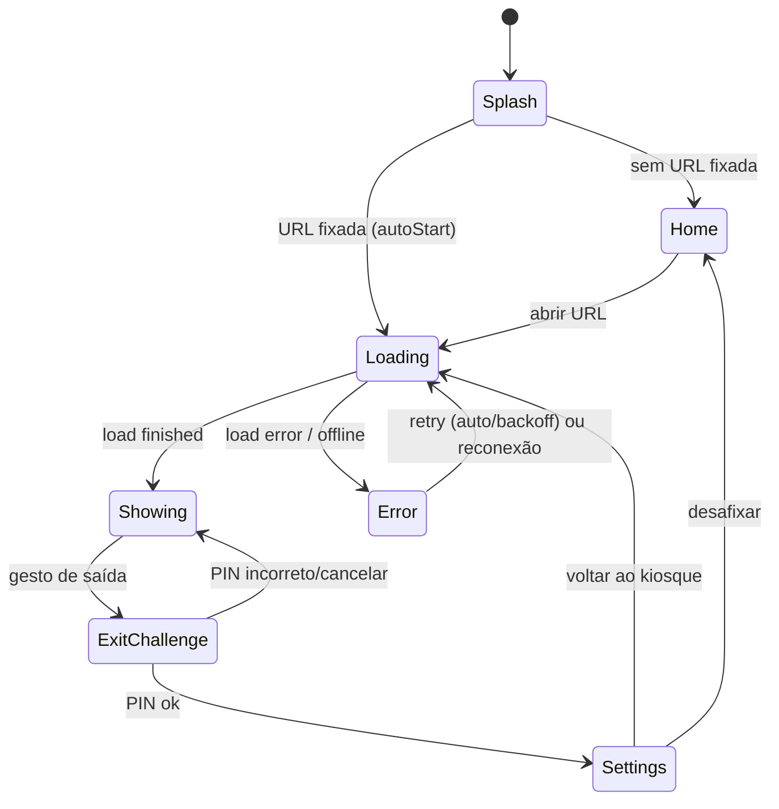

# SDD-004 — Modo Kiosque, Navegação e Telas

Cobre RF-01 a RF-04, RF-08 a RF-13: telas, fixação de URL, bloqueio de kiosque,
gesto de saída e navegação por D-pad.

---

## 1. Telas e rotas

Rotas via `go_router`:

| Rota | Tela | Quando |
|------|------|--------|
| `/` | `SplashScreen` | Boot: lê config e redireciona |
| `/home` | `HomeScreen` | Sem URL fixada (ou após sair do kiosque) |
| `/kiosk?url=...` | `KioskScreen` | Abrindo uma URL |
| `/settings` | `SettingsScreen` | A partir do gesto de saída |

Redirecionamento no splash:

```dart
redirect: (ctx, state) {
  final cfg = ref.read(kioskConfigProvider);
  if (state.matchedLocation == '/') {
    if (cfg.autoStart && cfg.pinnedUrl != null) {
      return '/kiosk?url=${Uri.encodeComponent(cfg.pinnedUrl!)}';
    }
    return '/home';
  }
  return null;
}
```

---

## 2. HomeScreen (RF-01, RF-12, RF-13)

- Campo de texto para URL com:
  - **Normalização:** adiciona `https://` se faltar esquema; valida com `Uri.tryParse`.
  - Teclado de URL (`TextInputType.url`).
- Botão **"Abrir"** → navega para `/kiosk`.
- Toggle **"Fixar esta URL"** → ao abrir, grava `pinnedUrl` + `autoStart=true`.
- **Lista de recentes** (RF-12), selecionável por D-pad.
- **Android TV (RF-13):** usar `FocusTraversalGroup`, `Focus`/`FocusableActionDetector`
  e bordas de foco visíveis; primeiro foco no campo de URL ou no primeiro recente.
  Teclas D-pad mapeadas por `Shortcuts`/`Actions` (setas + OK/ENTER).

Layout responsivo: a mesma tela serve TV (10-foot UI, fontes/áreas de toque
maiores, foco evidente) e Windows (mouse/teclado). Detectar via
`MediaQuery`/`defaultTargetPlatform`.

---

## 3. KioskScreen (RF-02)

Composição (Stack):

```
Stack
 ├─ AppWebView (preenche a tela)       // conteúdo
 ├─ ErrorOverlay (condicional)         // falha de rede + retry
 ├─ LoadingOverlay (condicional)       // primeira carga
 └─ ExitGestureDetector (transparente) // canto/sequência p/ sair
```

Comportamento:
- Entra em **tela cheia/imersivo** ao montar; restaura ao sair (ver §4).
- **Mantém tela ligada** com `wakelock_plus` (RF-10).
- **Bloqueio de navegação para fora do escopo** via `shouldOverrideUrlLoading`:
  - Permitir navegação dentro do mesmo host (ou conforme `allowedHosts` em config).
  - Bloquear `intent://`, `tel:`, esquemas externos e popups.
  - Opção `lockToInitialOrigin` (padrão **on**) para travar no domínio inicial.
- Sem barra de endereço, sem gestos de voltar do sistema (interceptados).

---

## 4. KioskModeService (tela cheia / bloqueio)

Interface comum, com implementações por plataforma:

```dart
abstract class KioskModeService {
  Future<void> enter();   // fullscreen + impedir saída
  Future<void> exit();    // restaurar UI normal
}
```

### Android (`kiosk_mode_service_android.dart`)
- `SystemChrome.setEnabledSystemUIMode(SystemUiMode.immersiveSticky)` — esconde
  status/navigation bars; reaparecem temporariamente com swipe e somem de novo.
- Interceptar botão **Voltar** (`PopScope`/`WillPopScope`) → não sai do WebView.
- **Wakelock** ligado.
- **Lock Task Mode (screen pinning) — opcional/avançado:** para travar de fato no
  app é preciso `startLockTask()` (nativo) e, idealmente, o app ser **Device
  Owner** (provisionamento ADB/MDM) para `setLockTaskPackages`. Documentado como
  *hardening* opcional, não obrigatório para a v1. Sem Device Owner, o usuário
  ainda pode sair pelo botão Home — aceitável para o cenário de instalação
  controlada.
- **Android TV:** sem botão Home na maioria dos controles; foco fica no app.

### Windows (`kiosk_mode_service_windows.dart`)
Com `window_manager`:
- `setFullScreen(true)`, `setTitleBarStyle(hidden)`, `setAlwaysOnTop(true)`
  (opcional), `setResizable(false)`.
- **Limitação:** não é possível bloquear `Alt+Tab`/`Ctrl+Alt+Del` só com Flutter.
  Para kiosque "duro" no Windows usar **Assigned Access (Kiosk Mode do Windows)**
  do SO apontando para o `.exe` — documentado no SDD-005 como configuração de SO,
  fora do código do app.
- Interceptar `Alt+F4` (best-effort) e o fechamento da janela
  (`setPreventClose(true)` + diálogo de PIN).

---

## 5. Saída do kiosque (RF-08, RF-09)

São oferecidos **dois caminhos** de saída, ambos passando pela verificação de PIN:

### 5.0 Controle visível e discreto (implementado)
Um controle translúcido fixo no **canto superior direito** (`KioskControls`),
com opacidade reduzida quando recolhido. Ao tocar no ícone de menu, expande com:
- **Configurações** → PIN → `/settings`
- **Tela inicial** → PIN → `/home`
- **Fechar ASAPainel** → PIN → encerra o app (`windowManager.destroy()` no
  desktop; `SystemNavigator.pop()` no Android)

Isso garante que o operador sempre consiga sair/fechar, mesmo quando o app abre
direto numa URL fixada. Para um kiosque mais "duro", defina um PIN de saída.

### 5.1 Gesto oculto (alternativa)

Sair do kiosque também pode ser feito por uma ação **deliberada e oculta**
(usuário final não descobre por acaso):

- **Touch (TV touchscreen / Windows touch):** tocar 5x no **canto superior
  esquerdo** dentro de 3s, ou pressionar e segurar 2 cantos.
- **Controle remoto (Android TV):** sequência de teclas (ex.: pressionar
  **MENU** por 3s, ou combinação ↑ ↑ ↓ ↓ OK) capturada por `RawKeyboard`/`Focus`.
- **Windows (teclado):** atalho `Ctrl+Shift+Q` (configurável).

Ao acionar:
1. Se `exitPinHash != null` → `PinDialog` (RF-09). Hash via `crypto` (sha256 +
   salt); comparar hashes, nunca armazenar PIN puro.
2. PIN correto (ou sem PIN) → `KioskModeService.exit()` e navegar para `/settings`
   (ou `/home`).

---

## 6. SettingsScreen

- Mostra URL fixada atual; botões **Trocar URL** e **Desafixar** (RF-04).
- Toggles: `autoplayAudio`, `ttsBridgeEnabled`, `lockToInitialOrigin`.
- **Definir/alterar PIN de saída** (RF-09).
- **Limpar dados do site** (cookies/cache/localStorage) via `StorageService`.
- Botão **Voltar ao kiosque** (retoma a URL fixada).
- Exibe versão do app e (em Windows) status do runtime WebView2.

---

## 7. Máquina de estados do kiosque



---

## 8. Acessibilidade e UX de TV (10-foot UI)

- Áreas focáveis grandes, alto contraste, indicador de foco nítido.
- Evitar dependência de hover; tudo navegável por D-pad.
- Mensagens de erro legíveis a 3 m de distância.
- Fonte mínima recomendada na Home: 24sp+ em TV.
